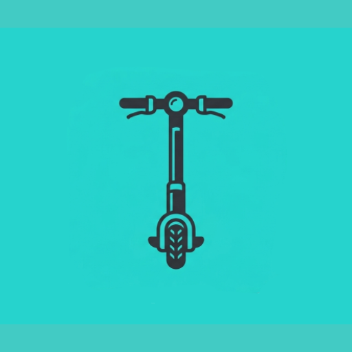
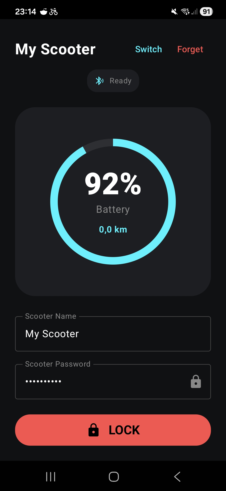

  

# OpenTIER - Open Source MyTier Scooter App
TIER has abandoned the development and support of the TIER App. So it is only a matter of time, when your MyTier Scooter will stop working.
I've reverse engineered the TIER App and created this open source app to keep your scooter alive as long as possible. The app is still in early development, but it already supports unlocking and locking the scooter, as well as reading out the battery level and the current range.

## Screenshots

## Bugs or Enhancements?
Find any Bugs or want new features? Please open an issue

## Support me?

## Changelog
### 1.0.0
- Initial release